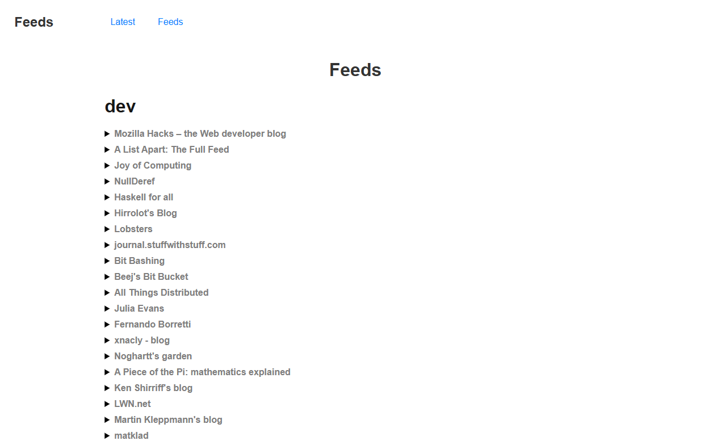

# Feed

Feed is a minimalist RSS feed reader inspired by [Bubo RSS](https://github.com/georgemandis/bubo-rss).

## Getting Started

1. clone the repository.
2. install dependencies (`npm install`).
3. check the `config` directory
    - `config/configs.json` contains basic configuration options
    - `config/feeds.json` contains RSS feed URLs.
    - four initial templates are provided. You can use these templates as they are, modify them, or create your own templates to fit your needs.
4. build feeds using the provided `build.sh` script.

## building feeds

the build command format expected is: `./build.sh {template_string} {feed_json_string}`,
you can build the project and output to an HTML file with the following command:

```sh
./build.sh "$(cat config/latest-full-template.html)" "$(cat config/feeds.json)" > output.html
```

## Screenshots
<details>
  <summary>Click to expand</summary>

  
  
</details>
